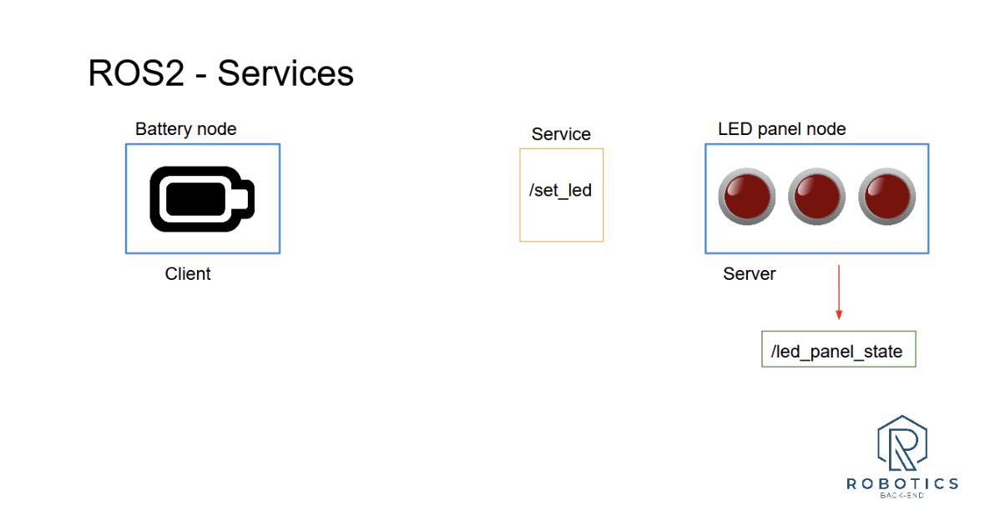
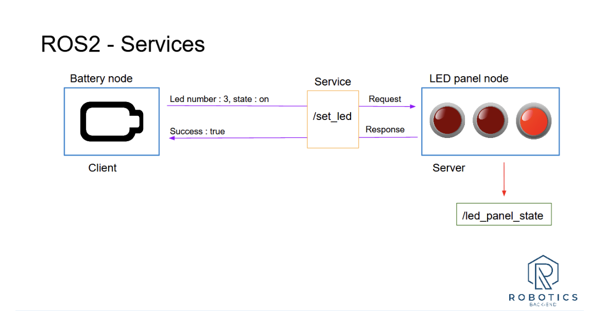
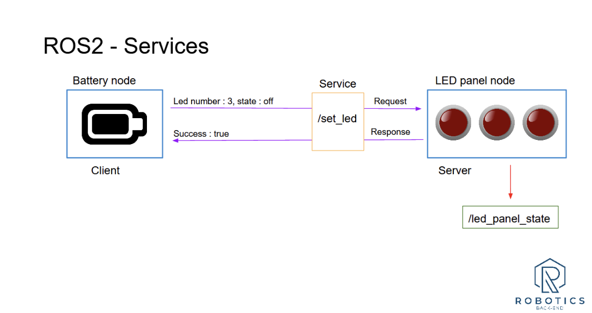

# 🔋 Battery-LED Panel Control using ROS2 Services and Topics
This project simulates a basic Battery and LED Panel System using ROS2, showcasing how services and topics work together in a distributed robotic application. It demonstrates effective ROS2 communication patterns including custom message and service definitions, node management, service-client interaction, and simulated state transitions.

## 📌 Problem Statement
I simulate a system with **2 nodes**:

**Battery Node**: Monitors and simulates battery status over time.
**LED Panel Node**: Displays LED status and responds to service calls to update LEDs.

When the battery is empty after **4 seconds**, it requests the LED panel to turn **ON** an **LED-3**. 

When the battery is full again after **6 seconds**, it requests the panel to turn **OFF** the **LED-3**. 

This cycle repeats indefinitely, until explicitly interrupted by ketboard.
